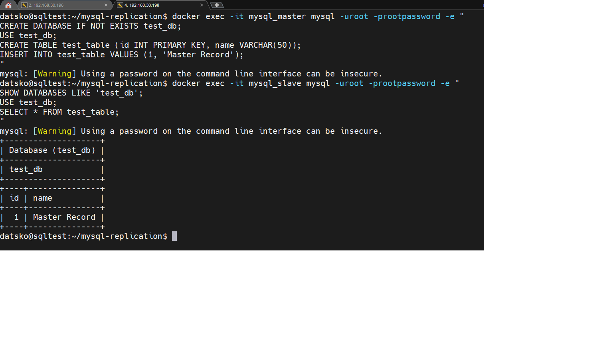

]# Домашнее задание к занятию "`Репликация и масштабирование. Часть 1`" - `Дацко Иван`


### Инструкция по выполнению домашнего задания

   1. Сделайте `fork` данного репозитория к себе в Github и переименуйте его по названию или номеру занятия, например, https://github.com/имя-вашего-репозитория/git-hw или  https://github.com/имя-вашего-репозитория/7-1-ansible-hw).
   2. Выполните клонирование данного репозитория к себе на ПК с помощью команды `git clone`.
   3. Выполните домашнее задание и заполните у себя локально этот файл README.md:
      - впишите вверху название занятия и вашу фамилию и имя
      - в каждом задании добавьте решение в требуемом виде (текст/код/скриншоты/ссылка)
      - для корректного добавления скриншотов воспользуйтесь [инструкцией "Как вставить скриншот в шаблон с решением](https://github.com/netology-code/sys-pattern-homework/blob/main/screen-instruction.md)
      - при оформлении используйте возможности языка разметки md (коротко об этом можно посмотреть в [инструкции  по MarkDown](https://github.com/netology-code/sys-pattern-homework/blob/main/md-instruction.md))
   4. После завершения работы над домашним заданием сделайте коммит (`git commit -m "comment"`) и отправьте его на Github (`git push origin`);
   5. Для проверки домашнего задания преподавателем в личном кабинете прикрепите и отправьте ссылку на решение в виде md-файла в вашем Github.
   6. Любые вопросы по выполнению заданий спрашивайте в чате учебной группы и/или в разделе “Вопросы по заданию” в личном кабинете.
   
Желаем успехов в выполнении домашнего задания!
   
### Дополнительные материалы, которые могут быть полезны для выполнения задания

1. [Руководство по оформлению Markdown файлов](https://gist.github.com/Jekins/2bf2d0638163f1294637#Code)

---

### Задание 1

Master-Slave (ведущий-ведомый) — это архитектура, в которой один сервер (master) принимает все операции записи (INSERT, UPDATE, DELETE), а один или несколько серверов (slave) только читают данные и реплицируют изменения с master’а.
Запись на slave запрещена (обычно через флаг read_only).
Используется для масштабирования чтения, резервного копирования и повышения отказоустойчивости. 

Master-Master (ведущий-ведущий) — это конфигурация, в которой оба сервера являются одновременно и master, и slave.
Каждый сервер может принимать запись, и изменения реплицируются в обе стороны.
Это даёт избыточность, балансировку записи и отказоустойчивость, но требует осторожности: возможны конфликты при одновременной записи в одну и ту же запись с разных узлов. 

Ключевые различия: 

В master-slave запись возможна только на одном узле, в master-master — на обоих.
Master-slave проще в настройке и безопаснее от конфликтов.
Master-master сложнее, но обеспечивает высокую доступность для записи.

---

### Задание 2. Настройка master-slave репликации в MySQL**

## Цель  
Настроить асинхронную master-slave репликацию между двумя экземплярами MySQL, запущенными в Docker-контейнерах, и проверить корректность синхронизации данных.

## Описание выполнения

### 1. Подготовка окружения
- Создана отдельная директория `~/mysql-replication`.
- Настроены конфигурационные файлы:
  - `master.cnf` — включён бинарный лог, установлен `server-id=1`.
  - `slave.cnf` — установлен `server-id=2`, включён режим `read-only`.
- Созданы SQL-скрипты:
  - `master.sql` — создаёт пользователя `repl` с плагином `mysql_native_password` и правами `REPLICATION SLAVE`.
  - Скрипт для slave (`slave.sql`) **не используется на этапе инициализации**, чтобы избежать ошибок подключения до готовности master.
- Созданы Dockerfile для master и slave на основе образа `mysql:8.0`.

### 2. Сборка и запуск
- Собраны образы:
  ```bash
  docker build -t mysql_master -f Dockerfile.master .
  docker build -t mysql_slave -f Dockerfile.slave .
  ```
### 3. Настройка репликации

После полной инициализации master:

Пользователь repl пересоздан с IDENTIFIED WITH mysql_native_password для совместимости без SSL.
На slave выполнены команды:

  ```bash
STOP REPLICA;
CHANGE REPLICATION SOURCE TO
  SOURCE_HOST='mysql_master',
  SOURCE_USER='repl',
  SOURCE_PASSWORD='slavepass',
  SOURCE_SSL=0;
START REPLICA;
  ```

### 4. Проверка работы

##### На master создана тестовая БД и таблица:

   ```bash
CREATE DATABASE test_db;
USE test_db;
CREATE TABLE test_table (id INT PRIMARY KEY, name VARCHAR(50));
INSERT INTO test_table VALUES (1, 'Master Record');.
```

##### На slave подтверждено наличие данных:

```bash
SHOW DATABASES LIKE 'test_db';
SELECT * FROM test_db.test_table;.
```


##### Вывод SHOW REPLICA STATUS\G показывает:
Replica_IO_Running: Yes
Replica_SQL_Running: Yes
Отсутствие ошибок репликации..


##### zadanie2

